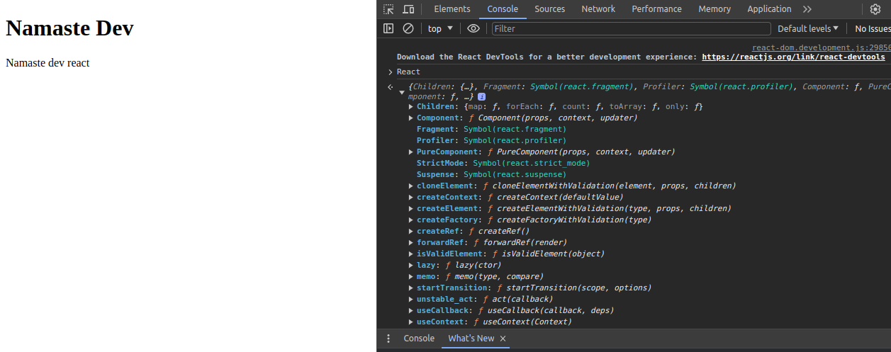

# namastedev-html-file

Creating the html element
importing the react with cdn links

the above the link for core react that was written by facebook developers in that like creating functions and varialbles

the above script can be used for manipulating the dom opearions

